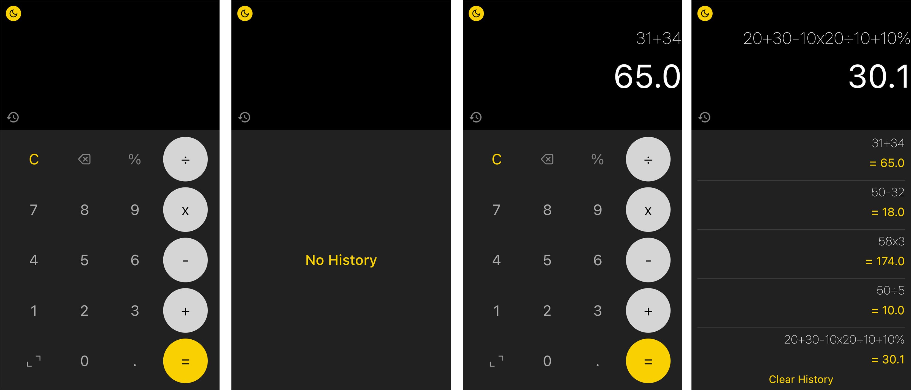
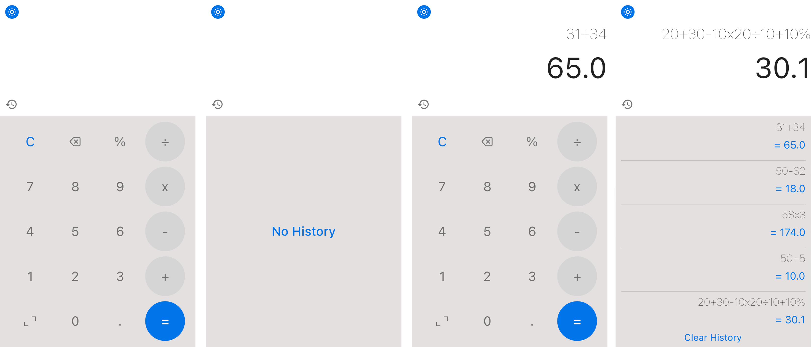

# Calculator App by using flutter

A new Flutter Calculator including dark and light theme.

**Features:**

- Dark & Light Theme
- Calculation History

**Packages we are using:**

- shared_preferences: [link](https://pub.dev/packages/shared_preferences)
- provider: [link](https://pub.dev/packages/provider)
- math_expressions: [link](https://pub.dev/packages/math_expressions)
- path: [link](https://pub.dev/packages/path)
- sqflite: [link](https://pub.dev/packages/sqflite)

Our Calculator app contains single screen and a special feature of saving every equation history.User can clear the history any time they want.

This is a complete functional calculator app that works on both Android and iOS devices. For state management, we use the provider package.

# Calculator App Final UI

**Dark Mode Final UI**

**Light Mode Final UI**

